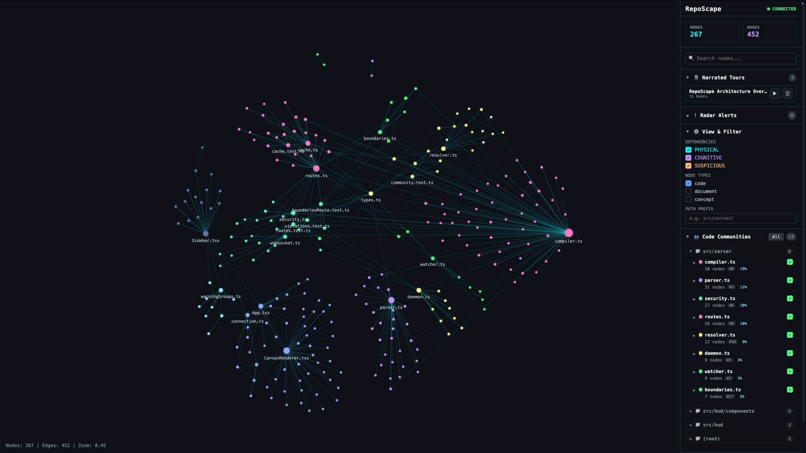
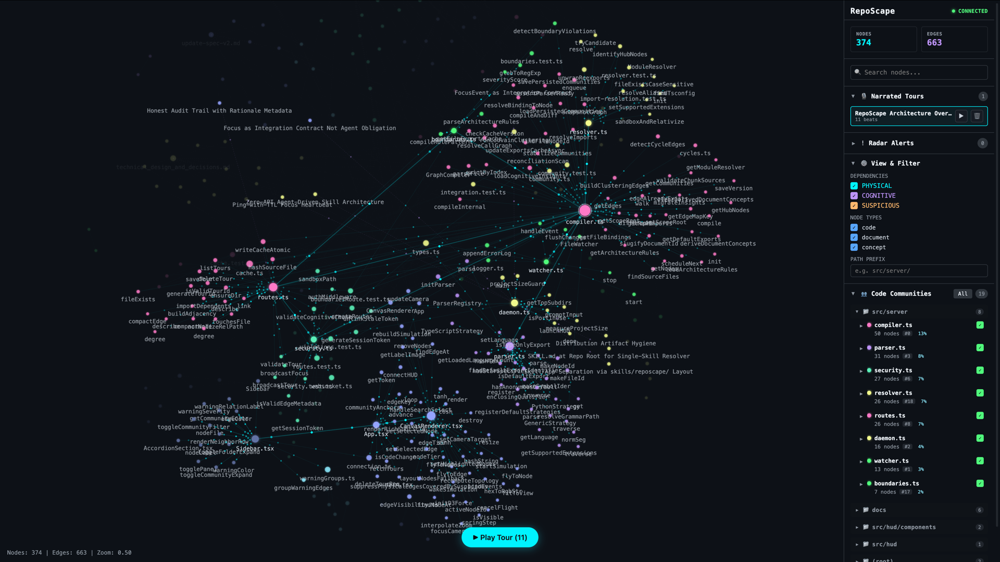

# RepoScape

[](LICENSE)
[](https://github.com/vercel-labs/skills)

**A living map of your codebase — and the reasoning reshaping it.** RepoScape renders your
repo as a graph — code structure *and* the agent-authored reasoning behind it — that updates
in real time as you and your AI agent work.

```bash
npx skills add ThomasLix7/RepoScape
```

Works in **Codex, Claude Code, Cursor, Antigravity, GitHub Copilot, Aider, OpenCode, Windsurf**, and any
agent that speaks the [Agent Skills](https://github.com/vercel-labs/skills) open standard.

The skill teaches your agent to read the repo as a graph — trace blast radius, find cycles,
explain *why* a module is shaped the way it is, and answer architecture questions by walking
real edges instead of grepping.

Backing the skill is a local daemon + GPU-accelerated HUD that parses the repo into a living
graph — physical `import`/`contains`/`call` edges plus the agent-authored cognitive layer —
watches for changes, and streams diffs to a canvas that pans, zooms, and glows as you and
your agent work. So the skill doesn't just *answer*: it can speak the answer aloud while the
HUD flies the camera to the nodes it's describing.

## ✨ Highlights

🔊 **Narrated tours** — ask an architecture question and RepoScape *answers out loud*: the
HUD speaks each beat while the camera flies to the exact nodes it's describing. Every tour is
persisted, listed in the sidebar, and replays with one click.

📡 **Live change radar** — a GPU-accelerated canvas (5,000+ nodes at a smooth **60 FPS**) that
recompiles on every edit and ripples + flies the camera to *where the change just landed*, in
real time. A deterministic layout keeps colors stable across saves, so the map never
reshuffles under you.

🧠 **Two graphs, fused** — the physical **code graph** (`import`/`contains`/`call`) and an
agent-extracted **cognitive graph** (concepts, rationale, intent) live in one model, *coupled*
so each cognitive node attaches to the exact code it explains. The AST shows what calls what;
the cognitive layer shows *why* — together they answer questions neither could alone.

🧩 **Token-frugal context for the agent** — instead of grepping and re-reading whole files
(which burns context window), the agent pulls the *graph*: a community-level overview, a
token-budgeted neighborhood around one node, or a file's exact blast radius. Sharper grounding
at a fraction of the tokens.

💬 **Grounded code understanding** — "what breaks if I change this?", "why is this here?" get
answers that **walk real edges and cite the rationale behind them**, weighted by provenance
(stated fact vs. inference) — reasoning with receipts, not a plausible-sounding guess.

🚨 **Architectural Safety Radar** — circular dependencies and boundary violations rendered as
red/orange edges **live on the canvas**, while you work, instead of at review time.

⚡ **Zero-config** — a single command boots the parser, watcher, server, and HUD in **<100ms**.
Tree-sitter ships pre-compiled as WASM — no API keys, no Python, no native build.

<p align="center">
  
  
</p>

## Why it matters in the vibe-coding era

When an AI agent writes most of the code, the bottleneck shifts from *typing* to
*understanding*. You're now reviewing and steering changes you didn't author, across files you
may never open — and that's exactly where developers lose the thread: spatial disorientation,
no mental model of what just moved or what it's wired to.

RepoScape closes that gap from both sides:

- **For you** — it keeps the *structure* the agent is reshaping visible in real time, so you
  always see what changed and what it's connected to. Instead of watching files scroll past,
  you watch the repo's shape light up where the work is happening.
- **For the agent** — it replaces lossy, token-hungry grepping with a precise structured map,
  so the agent's edits are grounded in the repo's actual topology, its answers cite real
  dependencies, and it knows the blast radius *before* it touches a thing.

Reach for it when you're new to a codebase and need its shape before touching anything, when
an agent is making sweeping edits you want to keep spatial track of, or when you want
architecture rules that are visible and CI-checkable instead of buried in a linter config.

## Install

RepoScape is two things in one repo, and you install them separately:

| Part | What it is | How you get it |
| --- | --- | --- |
| **The skill** | `skills/reposcape/SKILL.md` — the instruction set your coding agent loads to extract the cognitive layer, answer architecture questions, and drive tours | `npx skills` |
| **The app** | The daemon + HUD that compiles and renders the graph | `npm i -g reposcape` |

The skill is the heart of RepoScape — the cognitive layer, narrated tours, and
topology-aware answers all come from your coding agent following it. The app is the
daemon + HUD it talks to and renders into; it can run on its own, but the skill is what
makes it more than a graph viewer.

### 1. The skill — your coding agent

RepoScape installs with [`npx skills`](https://github.com/vercel-labs/skills), the
package manager for the Agent Skills open standard. The default detects whichever agent
your project uses (Claude Code, Cursor, Windsurf, Copilot, Aider, OpenCode, Codex, …):

```bash
npx skills add ThomasLix7/RepoScape
```

Install into several agents at once with `-a` (this replaces the old `--bootstrap` flag):

```bash
npx skills add ThomasLix7/RepoScape \
  -a claude-code,cursor,windsurf,copilot,aider
```

Pin to a tag or commit for reproducible CI / shared environments:

```bash
npx skills add ThomasLix7/RepoScape@v5.0.0
```

**Iterating on `SKILL.md` locally.** When editing the skill, install from the working
copy:

```bash
npx skills add ./
```

This is safe because the skill source is the isolated `skills/reposcape/` directory, not
the repo root — `npx skills` copies only that subtree, never `node_modules/` or `dist/`.
(Pointing it at a repo root that contains a top-level `SKILL.md` would copy the whole
project and recurse into its own output, which is exactly why the skill lives in a
subdirectory.)

Once installed, the skill gives your agent the `/reposcape` command surface:

```
/reposcape                      # answer an architecture question, or drive HUD analysis
/reposcape update               # refresh cognitive insights for changed docs (git-aware)
/reposcape update <path...>     # ...scoped to the given files or directories
/reposcape update force <path>  # re-extract the given docs even if git sees no change
```

Beyond the explicit commands, the skill also acts on its own: it boots the daemon when it's
offline, imports boundary rules from an existing dependency-cruiser config, fetches a
file's blast radius before an edit, and answers architecture questions as **narrated tours**
that speak aloud while the HUD flies the camera to each node. The full behaviour spec lives
in [`skills/reposcape/SKILL.md`](skills/reposcape/SKILL.md).

### 2. The app — daemon + HUD

```bash
npm install
npm run build
reposcape                 # parse + watch the current repo, open the HUD
```

The daemon compiles the initial graph in well under a second, starts a file watcher,
serves the HUD on `http://localhost:5173`, and opens your browser. Edit files and watch
the graph update in real time. Install globally via npm using `npm install -g reposcape`.

Useful flags:

- `--scope <dir>` — compile only a subdirectory (skips the size prompt on large repos).
- `--no-open` — start the daemon without launching a browser (for agent/CI use).
- `--force` — compile the whole repo without the interactive size prompt.

Development of RepoScape itself:

```bash
npm run dev               # daemon on :5174 + Vite HUD with hot reload
npm test                  # vitest
```

## Requirements

- **Node.js ≥ 18** — runs the daemon and the `npx skills` installer.
- **A coding agent that speaks the Agent Skills standard** — Claude Code, Cursor, Windsurf,
  Copilot, Aider, OpenCode, Codex, etc. The skill is agent-agnostic.
- **No API keys, no Python, no native toolchain.** Tree-sitter grammars ship pre-compiled as
  WASM, and the cognitive layer is authored by the agent already in your loop — RepoScape
  never makes its own billed model calls.

## How it works

```
 source files ──tree-sitter──▶ parser ──▶ compiler ──▶ graph (graphology)
      │                                       │              │
   chokidar watcher ──diffs──▶ recompile ─────┘              │
                                                             ▼
   agent insights (.reposcape/insights) ──merge──▶ Louvain communities
                                                             │
                                          WebSocket diffs ───┴──▶ canvas HUD
```

- **Parsing** uses pre-bundled WASM Tree-sitter grammars — no native toolchain, no Python.
- **Communities** run native `graphology` + Louvain in <5ms, pinned to a deterministic seed
  and aligned across recompiles by Jaccard overlap so colors stay stable.
- **The cognitive layer** is merged from per-file JSON in `.reposcape/insights/`, so it
  survives restarts and re-extraction is idempotent.

The graph carries three edge classes:

| Class | Edges | Source |
| --- | --- | --- |
| **Physical** | `imports`, `contains`, `calls` | Tree-sitter AST — always present |
| **Cognitive** | `COGNITIVE`, `rationale_for` | Agent extraction from docs/design notes |
| **Suspicious** | `circular`, `violates_boundary` | Radar — cycles + boundary rules |

Toggle any layer from the sidebar's **Show & Filter** legend; the **Code Communities**
panel lists each Louvain cluster and its hub.

## Architectural Safety Radar

The radar surfaces architectural risk directly on the canvas. Two kinds are detected:

- **Circular dependencies** — found automatically from the physical graph. No config.
- **Boundary violations** — forbidden imports you declare in
  `.reposcape/architecture_rules.json`.

### Declaring boundary rules

```json
{
  "boundaries": [
    {
      "from": "src/hud/**",
      "to": "src/server/**",
      "severity": "error",
      "reason": "Frontend views must not import server modules directly"
    }
  ]
}
```

- `from` / `to` — path globs (`**` spans directories, `*` does not). A rule fires when a
  file matching `from` imports a file matching `to`. First matching rule wins per import.
- `severity` — `error` (default) or `warn`.
- `reason` — optional message shown in the sidebar when the edge is selected.

Editing the file re-triggers a compile, so violations update live. Already use
[dependency-cruiser](https://github.com/sverweij/dependency-cruiser)? Convert its
`forbidden` rules instead of hand-writing them:

```bash
node skills/reposcape/convert-deps.mjs <projectRoot> --dry-run
```

### Reading the radar

- **Colour encodes severity:** red = must-fix (`error`, or a high-risk cycle), orange =
  warning. These two colours are reserved for the radar — normal nodes never use them.
- **Dash pattern encodes kind:** boundary violations and cycles use distinct dashes.
- When a radar edge shares a node pair with a physical edge, the physical edge is
  suppressed so the warning stays readable.
- **Click an edge** for the violation reason; toggle the `SUSPICIOUS` layer from the legend.

### Querying violations programmatically

`SUSPICIOUS` edges are excluded from `GET /api/graph` to keep the visual graph clean, but
are available as a structured list for CLI/CI/agent checks:

```bash
curl -H "Authorization: Bearer $TOKEN" http://localhost:5173/api/violations
```

```json
{
  "violations": [
    {
      "relation": "violates_boundary",
      "severity": "error",
      "reason": "Frontend views must not import server modules directly",
      "source": { "label": "App.tsx", "file": "src/hud/components/App.tsx" },
      "target": { "label": "compiler.ts", "file": "src/server/compiler.ts" }
    }
  ]
}
```

## Narrated tours

When you ask your agent an architecture question ("where are the cycles?", "what depends
on this module?", "why is it built this way?"), it can answer with a **narrated tour**: the
HUD speaks each beat aloud while the camera glides to the node(s) it describes and
highlights them. Tours persist under `.reposcape/tours/` (most recent 50), appear in the
sidebar's **Narrated Tours** list, and replay with one click.

This is driven by the agent through `POST /api/tour` — see the agent skill below.

## Agent integration

RepoScape ships a coding-agent skill at `skills/reposcape/SKILL.md`. The split of
responsibilities:

- **The daemon** owns the deterministic telemetry: file watching, recompilation, WebSocket
  diffs, community alignment, and session security.
- **The agent** owns only what needs language-model judgment: extracting the cognitive
  layer from docs, answering topology-aware architecture questions, and driving tours.

The skill is built to be context-cheap. Node ids are deterministic (computable from a file
path), and the graph can be queried in slices — a community-level overview, a token-budgeted
neighborhood around one node, or a single-file boundary briefing — rather than loading the
whole graph.

## Source of truth

The skill is authored in [`skills/reposcape/SKILL.md`](skills/reposcape/SKILL.md); `npx skills`
mirrors that file into your agent. File issues about skill behaviour, the daemon, or the HUD
on [github.com/ThomasLix7/RepoScape](https://github.com/ThomasLix7/RepoScape).

## License

MIT
