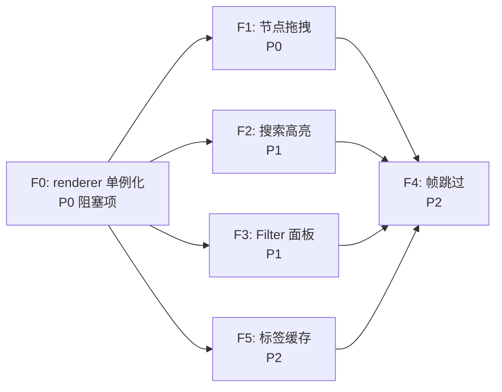

# Build-Spec: Obsidian Graph View Alignment

将 RepoScape 图谱渲染对齐 Obsidian Graph View 的 5 项能力。

---

## Feature 0 · 前置重构：渲染器单例化 (P0，阻塞项)

**问题**: [App.tsx 的渲染 effect](file:///Users/lihongtao/RepoScape/src/hud/components/App.tsx#L131-L167) 当前把 `new CanvasRenderer()` 写在依赖为 `[nodes, edges, showPhysical, showCognitive, showSuspicious, hubNodes]` 的 effect 里。**每次流式 diff 改变 `nodes`/`edges`，整个 renderer 被销毁重建** —— `nodePositions`、camera、d3 simulation 全部重置，图谱在每次更新时跳变。

**为什么阻塞后续 Feature**: F1 的 `pinnedNodes`、F2 的 `highlightedNodes`、F4 的 `lastFrameHash`、F5 的 `labelCache` 全是 renderer 实例字段。只要 renderer 在每次 diff 时重建，这些状态就会被清空 —— 这几个 Feature 会"看起来实现了但实际不生效"。

### 改动范围

#### [MODIFY] [App.tsx](file:///Users/lihongtao/RepoScape/src/hud/components/App.tsx)

拆成两个 effect + 用 ref 推送最新数据，renderer 只创建一次：

```typescript
// effect A：仅挂载时创建 renderer（依赖 []）
useEffect(() => {
  if (!canvasRef.current) return;
  const renderer = new CanvasRenderer(canvasRef.current);
  rendererRef.current = renderer;
  renderer.onNodeClick = (node) => { setSelectedNode(node); setSelectedEdge(null); };
  renderer.onEdgeClick = (edge) => { setSelectedEdge(edge); setSelectedNode(null); };

  let animId: number;
  let lastTime = performance.now();
  const loop = () => {
    const now = performance.now();
    const dtMs = now - lastTime;
    lastTime = now;
    const s = renderStateRef.current;        // 读取最新数据（见下）
    renderer.render(s.nodes, s.edges, {
      showPhysical: s.showPhysical,
      showCognitive: s.showCognitive,
      showSuspicious: s.showSuspicious,
      hubNodes: s.hubNodes,
      dtMs,
    });
    animId = requestAnimationFrame(loop);
  };
  animId = requestAnimationFrame(loop);
  return () => { cancelAnimationFrame(animId); renderer.destroy(); };
}, []);

// effect B：把最新 state 写进 ref，供 rAF loop 读取（不重建 renderer）
const renderStateRef = useRef({ nodes, edges, showPhysical, showCognitive, showSuspicious, hubNodes });
renderStateRef.current = { nodes, edges, showPhysical, showCognitive, showSuspicious, hubNodes };
```

> [!IMPORTANT]
> F3 的 `filteredNodes`/`filteredEdges` 也通过这个 ref 推送，而非新建 effect。所有"传给 renderer 的数据"都走 `renderStateRef`，确保 renderer 实例生命周期与数据更新解耦。

#### 副作用：移除节点的位置清理（必须处理）

当前每次 diff 都重建 renderer，相当于**隐式 GC** 了 `nodePositions`。改成单例后，[rebuildSimulation](file:///Users/lihongtao/RepoScape/src/hud/components/CanvasRenderer.tsx#L134-L204) 只增不删 —— 被 diff 移除的节点会在 `nodePositions`/`nodeSizes`/`pinnedNodes` 里**永久残留**。而 [findNodeAt](file:///Users/lihongtao/RepoScape/src/hud/components/CanvasRenderer.tsx#L312-L327) 和 [fitToView](file:///Users/lihongtao/RepoScape/src/hud/components/CanvasRenderer.tsx#L386-L402) 都遍历 `nodePositions` → 幽灵节点会变成隐形命中区、并污染 auto-fit 包围盒。

新增 renderer 方法，由 `handleDiff` 在收到 `diff.removedNodes` 时调用：

```typescript
removeNodes(ids: string[]): void {
  for (const id of ids) {
    this.nodePositions.delete(id);
    this.nodeSizes.delete(id);
    this.pinnedNodes.delete(id);
  }
}
```

```typescript
// App.tsx handleDiff 内，setEdges 之后
if (diff.removedNodes.length) rendererRef.current?.removeNodes(diff.removedNodes);
```

> [!WARNING]
> 清理必须基于 **`diff.removedNodes`（真实删除）**，而不是传给 render 的渲染集。F3 的 filter 只是"隐藏"，被过滤掉的节点位置要保留 —— 否则每次切 filter 都会丢失布局、重新开 filter 时全部重排。

### 验证

- 触发一次 diff（新增/删除节点）→ camera、已 pin 节点、已展开的图布局保持不变，不跳变
- `rendererRef.current` 在整个会话中是同一个实例（devtools 断点确认 constructor 只跑一次）
- diff 移除某节点 → 该处不再有隐形命中区，auto-fit 包围盒不被幽灵撑大
- 切 filter 隐藏再显示一组节点 → 位置保持（不重排）

---

## Feature 1 · 节点拖拽 + Pin (P0)

**目标**: 用户可拖拽单个节点重新定位；松手后节点固定 (`fx/fy`)；双击取消固定。

### 现状

- [CanvasRenderer.tsx](file:///Users/lihongtao/RepoScape/src/hud/components/CanvasRenderer.tsx) 的 `mousedown` 仅驱动画布平移
- [D3Node 接口](file:///Users/lihongtao/RepoScape/src/hud/components/CanvasRenderer.tsx#L22-L33) 已声明 `fx?: number | null` / `fy?: number | null`，但从未赋值
- `findNodeAt()` 已实现节点命中检测

### 改动范围

#### [MODIFY] [CanvasRenderer.tsx](file:///Users/lihongtao/RepoScape/src/hud/components/CanvasRenderer.tsx)

**新增状态**:
```typescript
private draggedNode: D3Node | null = null;
private pinnedNodes = new Set<string>();  // 持久化 pin 集合
```

**交互逻辑重写** — `bindEvents()`:

| 事件 | 当前行为 | 新增行为 |
|---|---|---|
| `mousedown` | 始终进入画布拖拽 | 先 `findNodeAt()` → 命中则进入**节点拖拽**模式；未命中则画布拖拽 |
| `mousemove` | 画布拖拽 / hover 检测 | 节点拖拽模式时：将鼠标世界坐标写入 `draggedNode.fx/fy`，更新 `nodePositions` |
| `mouseup` | 退出画布拖拽 | 节点拖拽模式时：将节点加入 `pinnedNodes`，保留 `fx/fy`；唤醒 simulation |
| `dblclick` | 无 | `findNodeAt()` → 命中且 pinned：清除 `fx/fy`，从 `pinnedNodes` 移除，`wakeSimulation()` |

**关键实现细节**:
```typescript
// mousedown handler (revised)
const hit = this.findNodeAt(e.clientX, e.clientY);
if (hit) {
  // 查找对应的 d3 节点
  const d3n = this.d3Nodes.find(n => n.id === hit.id);
  if (d3n) {
    this.draggedNode = d3n;
    // 冻结节点位置 — d3 不再驱动它
    d3n.fx = d3n.x;
    d3n.fy = d3n.y;
    this.d3Simulation?.alpha(0.3).restart();
  }
} else {
  this.isDragging = true;  // 画布拖拽
}

// mousemove handler (node drag path)
if (this.draggedNode) {
  const rect = this.canvas.getBoundingClientRect();
  // 屏幕坐标 → 世界坐标
  const wx = (e.clientX - rect.left - rect.width / 2) / this.camera.zoom + this.camera.x;
  const wy = (e.clientY - rect.top - rect.height / 2) / this.camera.zoom + this.camera.y;
  this.draggedNode.fx = wx;
  this.draggedNode.fy = wy;
  this.nodePositions.set(this.draggedNode.id, { x: wx, y: wy });
}
```

**渲染 Pin 标记**: 在节点绘制循环中，若 `pinnedNodes.has(node.id)`，绘制一个小 📌 图标或 4px 白色外环作为视觉提示。

**易错点 1 — 事件分散在两个 target**: 现有 `bindEvents()` 把 `mousedown`/`wheel`/`click` 绑在 `this.canvas`，把 `mousemove`/`mouseup` 绑在 `window`（见 [bindEvents](file:///Users/lihongtao/RepoScape/src/hud/components/CanvasRenderer.tsx#L262-L310)）。节点拖拽的 move 逻辑必须加进 **window 的** mousemove handler，并且 `if (this.draggedNode)` 分支要排在 `if (this.isDragging)` 之前。

**易错点 2 — 拖拽后会误触发 click**: canvas 上 `mousedown`+`mouseup` 必然合成一次 `click`（[现有 click handler](file:///Users/lihongtao/RepoScape/src/hud/components/CanvasRenderer.tsx#L296-L309) 会选中/取消选中节点）。拖动节点松手后这次 click 会紧接着触发，造成"拖完又选中/又清空 focus"的抖动。需在拖拽真正移动过时抑制后续 click：

```typescript
private didDrag = false;  // 本次按下是否发生了位移

// mouseup（node-drag 分支末尾）
if (this.draggedNode && this.didDrag) {
  this.suppressNextClick = true;  // 拖拽过 → 吞掉紧随的 click
}

// click handler 开头
if (this.suppressNextClick) { this.suppressNextClick = false; return; }
```

**易错点 3 — pin 必须在 rebuildSimulation 时重新施加**: [rebuildSimulation](file:///Users/lihongtao/RepoScape/src/hud/components/CanvasRenderer.tsx#L147-L159) 在节点集变化时用 `nodes.map(...)` **全新构造** `d3Nodes`，不会带上 `fx/fy`。若不处理，任何 diff 都会让已 pin 的节点"解钉"。在该 `map` 内补：

```typescript
const pinned = this.pinnedNodes.has(n.id) ? this.nodePositions.get(n.id) : null;
return {
  id: n.id,
  community,
  x: existing?.x ?? anchor.x + r * Math.cos(a),
  y: existing?.y ?? anchor.y + r * Math.sin(a),
  fx: pinned?.x ?? null,   // 重新固定
  fy: pinned?.y ?? null,
};
```

### 验证

- 拖拽节点 → 节点跟随鼠标，其他节点因力重新排布
- 松手 → 节点固定不动
- 双击 → 节点释放，被 simulation 重新调度
- 画布拖拽不受影响（点空白区域仍正常平移）
- 拖完节点松手 → **不**误触发节点选中/清空 focus（click 被抑制）
- pin 一个节点后触发一次 diff → 该节点保持固定不动

---

## Feature 2 · 搜索高亮 + Camera Fly-To (P1)

**目标**: Sidebar 顶部搜索框，输入关键字实时模糊匹配节点 label/id；选中结果后相机弹簧飞向目标节点并高亮。

### 改动范围

#### [MODIFY] [CanvasRenderer.tsx](file:///Users/lihongtao/RepoScape/src/hud/components/CanvasRenderer.tsx)

**新增 API**:
```typescript
// 外部调用：相机弹簧飞向指定节点
flyToNode(nodeId: string): void {
  const pos = this.nodePositions.get(nodeId);
  if (!pos) return;
  this.camera.targetX = pos.x;
  this.camera.targetY = pos.y;
  this.camera.targetZoom = Math.max(this.camera.targetZoom, 1.2);
  this.userInteracted = true;  // 阻止 auto-fit 覆盖
}

// 高亮节点集合（搜索结果）
private highlightedNodes = new Set<string>();

setHighlightedNodes(ids: Set<string>): void {
  this.highlightedNodes = ids;
}
```

**渲染变更**: 节点循环中，若 `highlightedNodes.has(node.id)`：
- 绘制脉冲外环：`shadowBlur = 12 + 4 * Math.sin(Date.now() / 300)`
  > ⚠️ 不要写成 `sin(Date.now())` —— `Date.now()` 是毫秒值，直接取 sin 的周期约 6ms，外环会高频闪烁。必须除以 ~300 把周期拉到 ~2s。
- 忽略 focus-mode 的 alpha 衰减（始终 alpha=1）

> [!IMPORTANT]
> 脉冲是逐帧动画，与 F4 帧跳过直接冲突：当图谱静止时 F4 会因指纹不变跳帧 → 脉冲冻结。F4 的指纹逻辑必须在 `highlightedNodes.size > 0` 时强制不跳帧（见 F4）。

#### [MODIFY] [Sidebar.tsx](file:///Users/lihongtao/RepoScape/src/hud/components/Sidebar.tsx)

在 `GRAPH STATS` 上方新增搜索输入框：

```tsx
<input
  type="text"
  placeholder="Search nodes…"
  value={searchQuery}
  onChange={e => onSearchChange(e.target.value)}
  style={{ /* neon dark-mode input styling */ }}
/>
{searchResults.length > 0 && (
  <ul className="search-results">
    {searchResults.slice(0, 8).map(node => (
      <li key={node.id} onClick={() => onSearchSelect(node.id)}>
        {node.label}
        <span className="search-result-path">{node.source_file}</span>
      </li>
    ))}
  </ul>
)}
```

#### [MODIFY] [App.tsx](file:///Users/lihongtao/RepoScape/src/hud/components/App.tsx)

**新增状态与回调**:
```typescript
const [searchQuery, setSearchQuery] = useState('');
const searchResults = useMemo(() => {
  if (!searchQuery.trim()) return [];
  const q = searchQuery.toLowerCase();
  return nodes.filter(n =>
    n.label.toLowerCase().includes(q) || n.id.toLowerCase().includes(q)
  );
}, [searchQuery, nodes]);

// 搜索变更 → 同步高亮集到 renderer
useEffect(() => {
  rendererRef.current?.setHighlightedNodes(
    new Set(searchResults.map(n => n.id))
  );
}, [searchResults]);

const handleSearchSelect = (nodeId: string) => {
  rendererRef.current?.flyToNode(nodeId);
  setSelectedNode(nodes.find(n => n.id === nodeId) ?? null);
  setSearchQuery('');
};
```

向 `<Sidebar>` 传入 `searchQuery`, `searchResults`, `onSearchChange`, `onSearchSelect`。

### 验证

- 输入 `"comp"` → 匹配 `compiler.ts` 等节点，画布上对应节点出现脉冲环
- 点击结果 → 相机平滑飞到目标节点，zoom ≥ 1.2
- 清空搜索 → 高亮消失，回到正常渲染

---

## Feature 3 · 多维 Filter 面板 (P1)

**目标**: 在 Sidebar 现有 DEPENDENCY FILTER 下方，新增按 `file_type`、`community`、路径前缀过滤节点的能力。

### 改动范围

#### [MODIFY] [App.tsx](file:///Users/lihongtao/RepoScape/src/hud/components/App.tsx)

**新增 filter 状态**:
```typescript
const [activeFileTypes, setActiveFileTypes] = useState<Set<string>>(
  new Set(['code', 'document', 'concept'])
);
const [activeCommunities, setActiveCommunities] = useState<Set<number> | null>(null); // null = all
const [pathPrefix, setPathPrefix] = useState('');
```

**过滤逻辑** — 在传入 renderer 前过滤：
```typescript
const filteredNodes = useMemo(() => {
  return nodes.filter(n => {
    if (!activeFileTypes.has(n.file_type)) return false;
    if (activeCommunities && !activeCommunities.has(n.community ?? 0)) return false;
    if (pathPrefix && !n.source_file.startsWith(pathPrefix)) return false;
    return true;
  });
}, [nodes, activeFileTypes, activeCommunities, pathPrefix]);

const visibleNodeIds = useMemo(() => new Set(filteredNodes.map(n => n.id)), [filteredNodes]);

const filteredEdges = useMemo(() => {
  return edges.filter(e => visibleNodeIds.has(e.source) && visibleNodeIds.has(e.target));
}, [edges, visibleNodeIds]);

// Sidebar community 选择器的可选项（去重 + 排序）
const availableCommunities = useMemo(
  () => [...new Set(nodes.map(n => n.community ?? 0))].sort((a, b) => a - b),
  [nodes]
);
```

**与 F0 衔接**: 不要再开新 effect 把 `filteredNodes` 传给 renderer —— 改为让 F0 的 `renderStateRef` 携带 `filteredNodes`/`filteredEdges`（而非原始 `nodes`/`edges`）。rAF loop 始终渲染过滤后的数据。

> 注意 `nodeCount`/`edgeCount`（传给 Sidebar STATS）应反映 `filteredNodes.length`/`filteredEdges.length`，否则统计与画面不一致。

#### [MODIFY] [Sidebar.tsx](file:///Users/lihongtao/RepoScape/src/hud/components/Sidebar.tsx)

在现有 DEPENDENCY FILTER 下方新增 `NODE FILTER` 区块：

```
NODE FILTER
──────────────────
☑ code  ☑ document  ☑ concept     ← file_type toggle

Community: [All ▾]                 ← dropdown / chip 选择器

Path: [src/server/______]         ← 文本输入，空 = 不限
```

**Props 新增**:
```typescript
interface SidebarProps {
  // ... existing ...
  availableCommunities: number[];
  activeFileTypes: Set<string>;
  activeCommunities: Set<number> | null;
  pathPrefix: string;
  onToggleFileType: (ft: string) => void;
  onSetCommunities: (c: Set<number> | null) => void;
  onSetPathPrefix: (p: string) => void;
}
```

### 验证

- 取消勾选 `document` → 所有 `file_type: 'document'` 的节点及其边消失
- 选择 community 2 → 仅该社区的节点可见
- 输入路径前缀 `src/server/` → 仅匹配的节点可见
- 过滤器组合使用 → 交集生效

---

## Feature 4 · 局部渲染 (Dirty-Rect) (P2)

**目标**: 当图谱静止（simulation alpha < 阈值 + 无拖拽 + 无 hover 变化）时跳过重绘；运动时只重绘变化区域的包围盒。

### 现状

[render()](file:///Users/lihongtao/RepoScape/src/hud/components/CanvasRenderer.tsx#L441) 每帧 `fillRect(0, 0, w, h)` 全量重绘。Canvas 2D 下 dirty-rect 需要精确追踪上一帧每个对象的包围盒，复杂度较高。

### 设计选择

> 不采用 dirty-rect（Canvas 2D 下 clip 会引发 compositing 开销，得不偿失）。
> 采用 **frame-skip** 策略：如果本帧画面与上帧完全相同，直接跳过绘制。

#### [MODIFY] [CanvasRenderer.tsx](file:///Users/lihongtao/RepoScape/src/hud/components/CanvasRenderer.tsx)

**新增状态**:
```typescript
private lastFrameHash = '';  // 上一帧的轻量指纹
private frameSkipCount = 0;
private lastNodes: GraphNode[] | null = null;  // 数据引用比较，捕获纯数据更新
private lastEdges: GraphEdge[] | null = null;
```

**帧指纹计算** — 必须放在 `updateCamera(dtMs)` **之后**、清屏/绘制 **之前**（即现有 [line 456](file:///Users/lihongtao/RepoScape/src/hud/components/CanvasRenderer.tsx#L456) 调用 `updateCamera` 与 [line 487](file:///Users/lihongtao/RepoScape/src/hud/components/CanvasRenderer.tsx#L487) `fillRect` 之间）：

```typescript
// 数据引用变化 → 强制重绘（见下方 §hot-refresh 说明）。React 每次 setState 都给新数组。
const dataChanged = nodes !== this.lastNodes || edges !== this.lastEdges;
this.lastNodes = nodes;
this.lastEdges = edges;

// 脉冲高亮在播 / 本帧数据变了 → 永不跳帧
if (!dataChanged && this.highlightedNodes.size === 0) {
  const fingerprint = [
    this.camera.x.toFixed(1), this.camera.y.toFixed(1),
    this.camera.zoom.toFixed(3),
    nodes.length,
    this.hoveredNode?.id ?? '',
    this.selectedNodeId ?? '',
    this.d3Simulation?.alpha().toFixed(3) ?? '0',
    // 拖拽中的节点位置：否则慢速拖拽时 alpha 已衰减 → 指纹不变 → 拖拽视觉冻结
    this.draggedNode ? `${this.draggedNode.fx?.toFixed(1)},${this.draggedNode.fy?.toFixed(1)}` : '',
  ].join('|');

  if (fingerprint === this.lastFrameHash) {
    this.frameSkipCount++;
    return;  // 跳过本帧的绘制
  }
  this.lastFrameHash = fingerprint;
  this.frameSkipCount = 0;
}
```

> [!IMPORTANT]
> **顺序是关键**：指纹用的是 `camera.x`（当前位置），不是 `targetX`。`updateCamera()` 必须先跑，把 camera 朝 target 推进；否则当 `flyToNode` 改了 target、而其它信号未变时，指纹相等 → 提前 return → `updateCamera` 永远不执行 → 相机卡死，fly-to 失效。
>
> 指纹不含每个节点的精确坐标（太贵），用 simulation alpha 作为"是否还在运动"的代理信号；额外纳入**拖拽节点位置**和**高亮态**两个会逐帧变化、但 alpha 代理不到的来源。当 alpha 收敛、camera 弹簧 snap 到位、无拖拽、无高亮时，指纹稳定 → 跳帧。

> [!WARNING]
> **hot-refresh：alpha 代理不到"纯数据更新"。** [handleFocus](file:///Users/lihongtao/RepoScape/src/hud/components/App.tsx#L84-L106)（§2C 焦点事件）和它 61s 的 TTL 过期定时器都只 `setNodes` 改 `node.focus`，**不调用 `wakeSimulation`**，也不移动节点 → alpha 不变、camera 不变 → 若仅靠指纹会被跳帧，焦点绿光永远不亮。上面的 `dataChanged`（数组引用比较）正是为此：任何 `setNodes`/`setEdges` 产生的新数组都强制至少重绘一帧，覆盖 focus / activity / label 等所有不触发力学的字段更新。

**Camera 收敛检测**: 在 `updateCamera()` 末尾追加：
```typescript
// 当 camera 速度足够小时，snap 到 target 避免无限微振
if (Math.abs(this.camera.vx) < 0.01 && Math.abs(this.camera.vy) < 0.01) {
  this.camera.x = this.camera.targetX;
  this.camera.y = this.camera.targetY;
  this.camera.vx = 0;
  this.camera.vy = 0;
}
```

### 验证

- 图谱稳定后 → `frameSkipCount` 持续增长（devtools 打印确认）
- 鼠标 hover → 立即恢复绘制
- 节点拖拽 / zoom → 立即恢复
- **图谱静止时收到 focus 事件（§2C）→ 绿光立即亮起；61s 后 TTL 过期 → 绿光熄灭**（验证 `dataChanged` 强制重绘生效）
- **图谱静止时收到 diff → 立即重绘并反映增删改**
- 帧率在运动时不低于 55 FPS（Performance panel）

---

## Feature 5 · 标签纹理缓存 (P2)

**目标**: 避免每帧对每个可见节点调用 `ctx.fillText()`，用 `Map<string, ImageBitmap>` 缓存预渲染的标签纹理。

### 现状

[label 绘制](file:///Users/lihongtao/RepoScape/src/hud/components/CanvasRenderer.tsx#L605-L610) 每帧对每个符合 LOD 条件的节点执行 `ctx.fillText()`。当 zoom ≥ 1.4 时所有节点标签可见，数百次 `fillText` 产生可测量的开销。

### 设计选择

> 不上 OffscreenCanvas（兼容性和 worker 通信开销）。
> 用一个隐藏的普通 Canvas 元素作为 scratch pad 预渲染标签 → `drawImage()` 贴图。

#### [MODIFY] [CanvasRenderer.tsx](file:///Users/lihongtao/RepoScape/src/hud/components/CanvasRenderer.tsx)

> [!IMPORTANT]
> **缓存 key 不能含字号**。现有字号是 `Math.max(9, 11 / Math.max(0.5, zoom))`（[line 607](file:///Users/lihongtao/RepoScape/src/hud/components/CanvasRenderer.tsx#L607)），随 zoom 连续变化。若 key 含 `font`，则缩放过程中每一帧都 mint 新条目、命中率≈0 —— 恰好在"zoom ≥ 1.4、所有标签可见"这个最该提速的场景失效。
>
> 正确做法：**固定字号**渲染进缓存一次，按需用 `drawImage` 缩放到屏幕字号。缓存 key 只含文本（同一字体族下）。

**新增**:
```typescript
private labelCache = new Map<string, { img: HTMLCanvasElement; w: number; h: number }>();
private static readonly LABEL_FONT_PX = 13;  // 缓存固定字号（足够清晰，向下缩放不糊）

// 固定字号 + DPR 渲染，key 只含文本
private getLabelImage(text: string): { img: HTMLCanvasElement; w: number; h: number } {
  const cached = this.labelCache.get(text);
  if (cached) return cached;

  const dpr = window.devicePixelRatio || 1;
  const fontPx = CanvasRenderer.LABEL_FONT_PX;
  const font = `${fontPx}px monospace`;

  const scratch = document.createElement('canvas');
  const sctx = scratch.getContext('2d')!;
  sctx.font = font;
  const metrics = sctx.measureText(text);
  const w = Math.ceil(metrics.width) + 2;          // CSS 像素尺寸
  const h = Math.ceil(fontPx * 1.4) + 2;
  scratch.width = Math.ceil(w * dpr);              // 位图按 DPR 放大 → retina 不糊
  scratch.height = Math.ceil(h * dpr);
  sctx.scale(dpr, dpr);
  sctx.font = font;
  sctx.fillStyle = '#c9d1d9';
  sctx.textBaseline = 'top';
  sctx.fillText(text, 1, 1);

  const entry = { img: scratch, w, h };
  this.labelCache.set(text, entry);
  return entry;
}
```

**渲染替换**: 将 label 绘制从：
```typescript
ctx.fillText(node.label || node.id, pos.x, pos.y + size + 12);
```
改为（按目标字号 / 固定字号求缩放比，保持与原 fillText 的视觉字号一致）：
```typescript
const label = node.label || node.id;
const { img, w, h } = this.getLabelImage(label);
const targetPx = Math.max(9, 11 / Math.max(0.5, zoom));  // 原字号公式
const s = targetPx / CanvasRenderer.LABEL_FONT_PX;
const dw = w * s, dh = h * s;
// 原 textAlign='center'：水平居中；原 baseline 落在 pos.y+size+12
ctx.drawImage(img, pos.x - dw / 2, pos.y + size + 12, dw, dh);
```

**缓存失效策略**:
- key 只含文本、字号固定 → **zoom 不再触发任何失效**（缩放靠 drawImage，缓存全程命中）
- 节点集变化（新增/删除）时 → 不清缓存（新标签按需生成，旧条目无害）
- 缓存条目上限 2000，超过时清空整个 Map（粗粒度 LRU，P2 够用）

### 验证

- zoom ≥ 1.4 时帧率对比：关闭缓存 vs 开启缓存（500 节点场景下期望提升 15-30%）
- 标签视觉一致性：字体、颜色、对齐与原始 fillText 无差异
- zoom 跨越 LOD 阈值时标签字号正确更新

---

## 依赖顺序与实施建议



| 顺序 | Feature | 预估改动量 | 文件 |
|---|---|---|---|
| 0 | F0 renderer 单例化 | ~30 行重构 | App.tsx |
| 1 | F1 节点拖拽 | ~90 行 | CanvasRenderer.tsx |
| 2 | F2 搜索高亮 | ~60 行 renderer + ~50 行 Sidebar + ~30 行 App | 3 文件 |
| 3 | F3 Filter 面板 | ~50 行 App + ~60 行 Sidebar | 2 文件 |
| 4 | F5 标签缓存 | ~50 行 | CanvasRenderer.tsx |
| 5 | F4 帧跳过 | ~30 行 | CanvasRenderer.tsx |

> [!TIP]
> **F0 必须最先做**——它把 renderer 改成会话内单例，是 F1（pin 集合）、F2（高亮集合）、F4（帧指纹）、F5（标签缓存）的实例状态能跨数据更新存活的前提。跳过 F0，这几个 Feature 会"实现了但不生效"。
> F1 紧随其后——它重写 `bindEvents()` 的核心交互流程，后续交互（搜索选中 fly-to、filter 重绘）都依赖正确的事件分发。

## Verification Plan

### Automated
- 现有 `vitest` 测试套件通过：`npm test`
- TypeScript 编译无错误：`npx tsc --noEmit`

### Manual
- 每个 Feature 完成后在 dev 模式下启动 HUD（`npm run dev`），逐条验证上述各 Feature 的验证项
- Performance panel 采集帧率，确认 F4/F5 的优化效果
